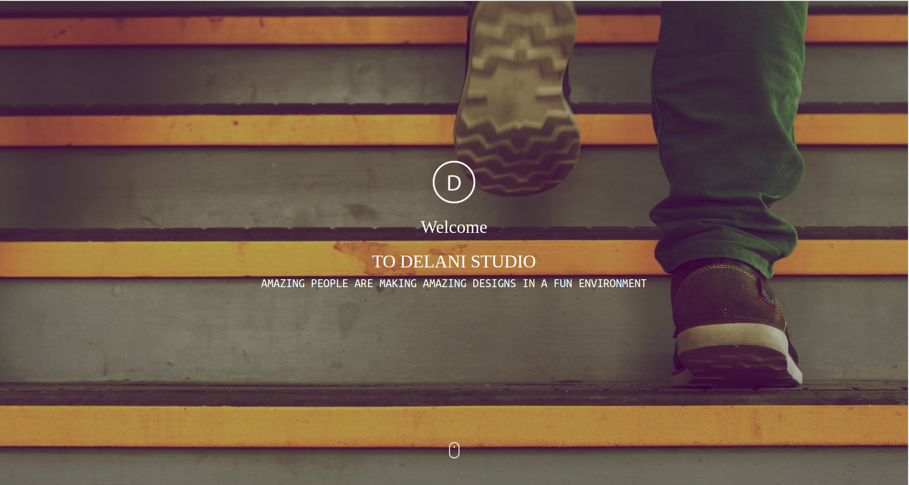

# Delani Studio

This is a landing page for Akan name generator

## Table of content

Delani studio

What we do

portfolio

About us 

social icon

---

### Application Descrption

Delani Studio is a site built to practice concepts learnt including JQuery, bootstrap, javascript and working with APIS's.

---

### Delani studio Form

---

### Delani studio portfolio

---

## Bugs.

The MailChimp API doesn't work properly.

---

## Technologies

#### html

#### css

#### javascript

#### jquery

---

## BDD

| Inputs  |                              Description |
| :------ | ---------------------------------------: |
| Name    |     The users name. `eg Justus onyancha` |
| Email   | The users email. `eg usermail@gmail.com` |
| Message |               The message from the user. |

the general behaviours/functionality of the project is that its intuitive because its direct and doesnt have to open in a new tab.
This website was designed to have little information but just the application to avoid clutter as a design principle..

---

## license

Our License is for public use and application can be copied.

---

### MIT license

Permission is hereby granted, free of charge, to any person obtaining a copy of this software and associated documentation files (the "Software"), to deal in the Software without restriction, including without limitation the rights to use, copy, modify, merge, publish, distribute, sublicense, and/or sell copies of the Software, and to permit persons to whom the Software is furnished to do so.

---

## Author

Github:https://github.com/Justusm10moringaschool?tab=repositories

Live Website: https://justusm10moringaschool.github.io/Delani-studio/

Twitter: @justusmo

---

## Contact

0714244366

email: justusm10@gmail.com
